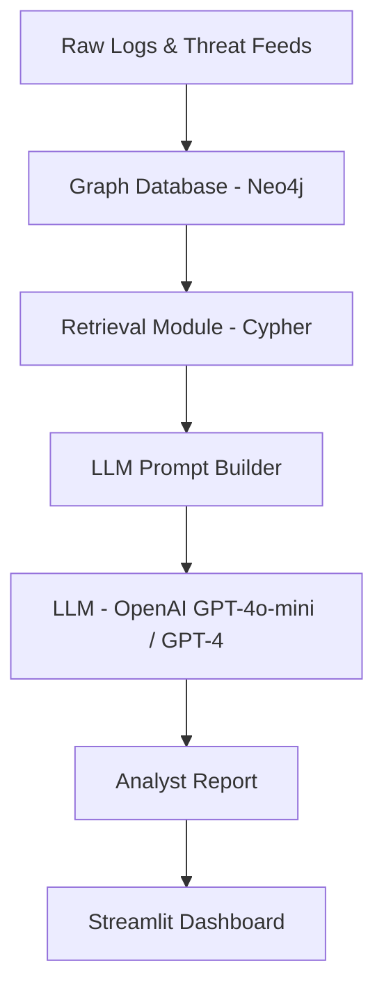

# 🛡️ Threat Detection via Graph + RAG + LLM

This project demonstrates a full-stack security analytics pipeline using **graph-based modeling**, **synthetic attack injection**, and **Retrieval-Augmented Generation (RAG)** with **LLMs**. It detects and explains threats like lateral movement, credential stuffing, and data exfiltration using real and synthetic data.

---

## 🚀 Features

- Graph schema for users, devices, IPs, malware, MITRE ATT&CK techniques, and campaigns
- ETL pipelines for LANL dataset, **Azure AD sign-in logs** (multi-tenant), and **MalwareBazaar** threat feed
- Synthetic attack injection (impossible travel, credential stuffing, lateral movement, exfiltration)
- **MITRE ATT&CK enrichment** — maps attacks to real technique IDs (T1078, T1110, T1021, T1041, etc.)
- Cypher-based detection queries for graph anomalies
- **Graph algorithms** — PageRank, community detection, betweenness centrality, shortest path attack tracing, degree anomaly scoring
- **Graph ML (Node2Vec)** — node embeddings + unsupervised anomaly detection to find suspicious entities
- **Campaign clustering** — groups related attacks into campaigns, kill chain coverage analysis, threat attribution, infrastructure overlap detection
- RAG pipeline: graph retrieval → LLM prompt → analyst-friendly report
- Streamlit dashboard with query selection, interactive graph visualization, advanced analytics tabs, and AI-generated analysis
- **Docker Compose** — full stack in one command
- **Pytest test suite** — 59+ tests for connection, attacks, MITRE, algorithms, ML, campaigns, data ingestion, and RAG
- **Jupyter notebook** — step-by-step walkthrough with visualizations

---

## 🧱 Architecture Overview



---

## 📦 Data Sources

| Source | Purpose | Status |
|---|---|---|
| LANL Dataset | Auth logs, process activity, network flows | ✅ Implemented |
| Azure AD Sign-In Logs | Identity events, risk levels, MFA, conditional access | ✅ Implemented |
| MalwareBazaar | Malware hashes, families, IOCs | ✅ Implemented |
| MITRE ATT&CK | TTP mapping and enrichment | ✅ Implemented |
| Synthetic Injection | Faker/Mimesis-generated attack scenarios | ✅ Implemented |
| CICIDS2017 | Network traffic (benign + attack) | 🔜 Planned |

---

## 🧪 Synthetic Attack Injection

Simulated attack scenarios using Faker and Mimesis:

| Attack | Description |
|---|---|
| **Impossible Travel** | Same user logs in from distant locations within minutes |
| **Credential Stuffing** | Multiple failed logins from one IP |
| **Lateral Movement** | Sequential device access across the network |
| **Data Exfiltration** | Large outbound traffic to suspicious IP |

---

## 🔍 Detection Queries (Cypher)

### Impossible Travel

```cypher
MATCH (u:User)-[r:AUTHENTICATED_TO]->(d:Device)
WITH u, collect(r.location) AS locations, collect(datetime(r.timestamp)) AS times
WHERE size(apoc.coll.toSet(locations)) > 1
  AND duration.inMinutes(min(times), max(times)) < 30
RETURN u.user_id, locations, times;
```

---

## 🧠 RAG Pipeline

The RAG module retrieves graph context via Cypher queries and constructs a prompt for the LLM:

1. **Retrieve** — Run detection queries against Neo4j to gather suspicious subgraphs
2. **Augment** — Format entities and relationships into structured prompt context
3. **Generate** — Send the augmented prompt to the LLM (GPT-4o-mini / GPT-4) for analysis

### Prompt Template

```
[Retrieved Graph Context]
Entities: Users, Devices, IPs, Malware, Techniques, Campaigns
Relationships: AUTHENTICATED_TO, COMMUNICATED_WITH, MATCHES_MALWARE, ...

[Task]
1. Summarize suspicious activity
2. Map to MITRE ATT&CK techniques
3. Suggest attacker goals
4. Recommend response actions
```

---

## 📊 Dashboard

Built with **Streamlit**, the dashboard includes:

- **Sidebar** — Query selection and filters
- **Center panel** — Interactive graph visualization (PyVis + NetworkX)
- **Right panel** — LLM-generated analyst report

### Run

```bash
streamlit run dashboard/dashboard.py
```

---

## 📁 Project Structure

```
graphdetection/
├── config/
│   ├── neo4j_connection.py       # Neo4j driver & session manager
│   └── schema_setup.py           # Constraints, indexes, schema verification
├── data_ingestion/
│   ├── lanl_etl.py               # LANL auth + network flow ETL
│   ├── azure_ad_etl.py           # Azure AD sign-in logs (multi-tenant)
│   ├── malwarebazaar_etl.py      # MalwareBazaar threat feed ingestion
│   └── mitre_enrichment.py       # MITRE ATT&CK technique mapping
├── synthetic_injection/
│   └── inject_attacks.py         # 4 attack scenario generators + cleanup
├── detection/
│   ├── cypher_queries.py         # Cypher detection queries + graph summary
│   ├── graph_algorithms.py       # PageRank, community, centrality, attack paths
│   ├── graph_ml.py               # Node2Vec embeddings + anomaly detection
│   └── campaign_clustering.py    # Campaign clustering + attribution
├── rag_pipeline/
│   └── generate_report.py        # Retrieve → Augment → Generate pipeline
├── dashboard/
│   └── dashboard.py              # Streamlit UI with graph viz + AI reports
├── tests/
│   ├── conftest.py               # Pytest fixtures & test isolation
│   ├── test_connection.py        # Neo4j connection & schema tests
│   ├── test_attacks.py           # Attack injection tests
│   ├── test_mitre.py             # MITRE ATT&CK mapping tests
│   ├── test_graph_algorithms.py  # Graph algorithm tests
│   ├── test_graph_ml.py          # Node2Vec + anomaly detection tests
│   ├── test_campaigns.py         # Campaign clustering tests
│   ├── test_data_ingestion.py    # Azure AD + MalwareBazaar tests
│   └── test_rag_pipeline.py      # RAG prompt construction tests
├── notebooks/
│   └── walkthrough.ipynb         # Interactive demo notebook
├── docs/
│   └── methodology.md            # Research methodology write-up
├── data/
│   ├── raw/lanl/                 # Place LANL dataset files here
│   └── processed/
├── .env.example                  # Environment variable template
├── .gitignore
├── Dockerfile
├── docker-compose.yml            # Full stack: Neo4j + pipeline + dashboard
├── requirements.txt
├── run.sh                        # Full pipeline runner script
├── plan.txt
└── README.md
```

---

## 🚀 Quick Start

### Option A: Docker Compose (recommended)

```bash
# Set up your API key
cp .env.example .env
# Edit .env with your OPENAI_API_KEY

# Launch everything: Neo4j + pipeline + dashboard
docker compose up --build

# Dashboard at http://localhost:8501
# Neo4j Browser at http://localhost:7474
```

### Option B: Local Setup

```bash
# 1. Install dependencies
pip install -r requirements.txt

# 2. Set up environment variables
cp .env.example ~/.env
# Edit ~/.env with your Neo4j password and OpenAI API key

# 3. Run the full pipeline (Neo4j → Schema → Inject → MITRE → Detect → Report → Dashboard)
./run.sh

# Or run individual steps:
./run.sh --skip-neo4j      # Neo4j already running
./run.sh --step 4          # Start from MITRE enrichment
./run.sh --dashboard       # Jump to dashboard
./run.sh --clean           # Remove synthetic data & stop Neo4j
```

---

## 🧪 Testing

```bash
pytest tests/ -v
```

Tests cover:
- Neo4j connectivity and schema validation
- Attack injection graph structure
- MITRE ATT&CK data integrity and ingestion
- RAG prompt template construction

---

## 📓 Notebook

An interactive walkthrough is available at [notebooks/walkthrough.ipynb](notebooks/walkthrough.ipynb) covering the full pipeline with inline visualizations.

---

## 📌 Requirements

- Python 3.9+
- Neo4j (local or cloud)
- OpenAI API key
- Streamlit

### Install

```bash
pip install -r requirements.txt
```

### Key Dependencies

- `neo4j` — Graph database driver
- `openai` — LLM integration
- `streamlit` — Dashboard UI
- `networkx` / `pyvis` — Graph visualization
- `pandas` — Data manipulation
- `faker` / `mimesis` — Synthetic data generation
- `loguru` — Structured logging
- `pytest` — Testing framework

---

## 📄 License

This project is for educational and portfolio demonstration purposes.